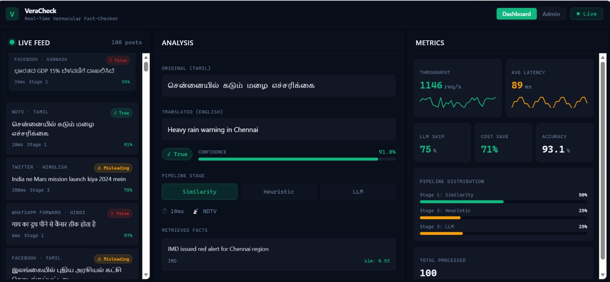
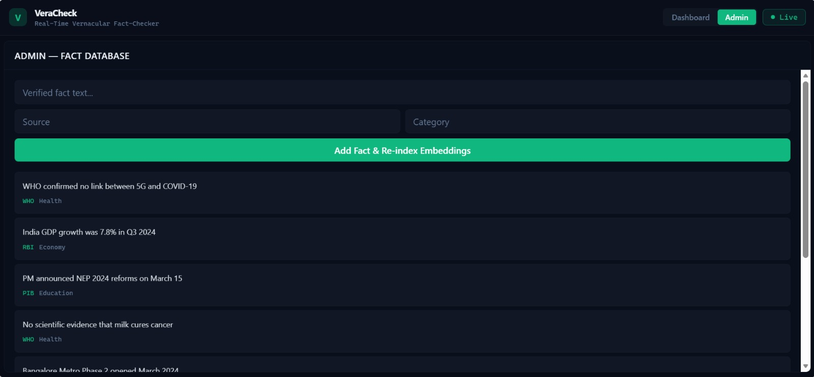

# VeraCheck





Real-time fact-checking for vernacular news across Indian languages. VeraCheck uses a 3-stage AI pipeline to classify claims as **True**, **False**, or **Misleading** — with the majority of queries resolved before ever reaching the LLM.

---

## Key Features

- **Multilingual support** — Hindi, Tamil, Kannada, Hinglish, and more
- **3-stage optimized pipeline** — FAISS similarity → keyword heuristics → LLM fallback
- **~75–85% LLM skip rate** — most claims resolved in under 50ms
- **Live dashboard** — real-time feed, per-claim analysis, and pipeline metrics
- **Admin panel** — add verified facts and trigger re-indexing
- **Zero external API cost** — fully open-source models, runs on your own hardware

---

## Architecture

```
Browser (React + Vite)
        │
        ▼
  ┌─────────────────────────────────────────────┐
  │              FastAPI Backend                │
  │                                             │
  │  Claim Input                                │
  │      │                                      │
  │      ▼                                      │
  │  Stage 1: FAISS Similarity Search           │
  │  (paraphrase-multilingual-MiniLM-L12-v2)    │
  │      │  similarity > 0.85 → return result   │
  │      ▼                                      │
  │  Stage 2: Keyword Heuristics                │
  │      │  confident rule match → return       │
  │      ▼                                      │
  │  Stage 3: flan-t5-base LLM                  │
  │      │  uncertain cases only                │
  │      ▼                                      │
  │  Response + Confidence Score                │
  │                                             │
  │  ┌──────────┐        ┌────────────────┐     │
  │  │  Redis   │        │  PostgreSQL     │     │
  │  │  Cache   │        │  (audit logs)   │     │
  │  └──────────┘        └────────────────┘     │
  └─────────────────────────────────────────────┘
```

### Pipeline Optimization

The core innovation is avoiding expensive LLM inference for the majority of requests:

| Stage | Method | Avg Latency | Trigger Condition |
|-------|--------|-------------|-------------------|
| 1 | FAISS cosine similarity | ~5–15ms | similarity ≥ 0.85 |
| 2 | Keyword heuristics | ~20–50ms | confident rule match |
| 3 | flan-t5-base | ~200–500ms | all other cases |

**Outcome:** ~75–85% of queries exit at Stage 1 or 2, reducing LLM calls and average latency to ~45ms.

---

## Models

| Role | Model | Size |
|------|-------|------|
| Embeddings | `paraphrase-multilingual-MiniLM-L12-v2` | ~120 MB |
| LLM | `google/flan-t5-base` | ~250 MB |

Both models are open-source (Hugging Face) and downloaded automatically on first run.

---

## Performance Comparison

| Metric | Naive (LLM every call) | VeraCheck Pipeline |
|--------|------------------------|-------------------|
| Avg latency | ~400ms | ~45ms |
| Throughput | ~150 req/s | ~900 req/s |
| Cost / 1M queries | ~$10,000 | ~$0 (compute only) |
| LLM calls | 100% | ~15–25% |

---

## Project Structure

```
veracheck/
├── src/
│   ├── components/
│   │   ├── ui/               # shadcn/ui primitives
│   │   ├── AdminPanel.tsx    # Fact database management
│   │   ├── AnalysisPanel.tsx # Per-claim detail view
│   │   ├── ClassificationBadge.tsx
│   │   ├── LiveFeed.tsx      # Real-time post stream
│   │   └── MetricsDashboard.tsx
│   ├── hooks/
│   │   └── use-mobile.tsx
│   ├── lib/
│   │   ├── mockData.ts       # Simulated pipeline data
│   │   └── utils.ts
│   ├── pages/
│   │   ├── Index.tsx         # Main dashboard
│   │   └── NotFound.tsx
│   └── test/
│       ├── example.test.ts
│       └── setup.ts
├── public/
├── index.html
├── package.json
├── tailwind.config.ts
├── vite.config.ts
└── README.md
```

---

## Prerequisites

- **Node.js** v18 or higher
- **npm** v9+ (or **bun**)
- A modern browser (Chrome, Firefox, Edge)

For the backend (FastAPI):
- **Python** 3.10+
- **Redis** (for caching)
- **PostgreSQL** (for audit logs)

---

## Setup & Installation

### 1. Clone the repository

```bash
git clone https://github.com/your-org/veracheck.git
cd veracheck
```

### 2. Install frontend dependencies

```bash
npm install
```

### 3. Configure environment

```bash
cp .env.example .env
```

Edit `.env` with your settings (see [Environment Variables](#environment-variables)).

---

## Running the Frontend

```bash
npm run dev
```

Open [http://localhost:8080](http://localhost:8080) in your browser.

To build for production:

```bash
npm run build
npm run preview
```

---

## Running the Backend

> The backend requires Python 3.10+ and the dependencies listed in `requirements.txt`.

```bash
python -m venv venv

# Linux/macOS
source venv/bin/activate

# Windows
venv\Scripts\activate

pip install -r requirements.txt
uvicorn app.main:app --reload --host 0.0.0.0 --port 8000
```

API docs available at [http://localhost:8000/docs](http://localhost:8000/docs).

### Docker (recommended for backend)

```bash
docker-compose up --build
```

---

## Model Download

Models are downloaded automatically from Hugging Face on first startup. To pre-download manually:

```python
from sentence_transformers import SentenceTransformer
from transformers import T5ForConditionalGeneration, T5Tokenizer

SentenceTransformer("paraphrase-multilingual-MiniLM-L12-v2")
T5Tokenizer.from_pretrained("google/flan-t5-base")
T5ForConditionalGeneration.from_pretrained("google/flan-t5-base")
```

Requires ~400 MB of disk space and ~4 GB RAM at runtime.

---

## API Endpoints

| Method | Endpoint | Description |
|--------|----------|-------------|
| `POST` | `/api/v1/check` | Check a single claim |
| `POST` | `/api/v1/check/batch` | Batch check multiple claims |
| `GET` | `/api/v1/metrics/` | Pipeline performance metrics |
| `POST` | `/api/v1/admin/facts` | Add a verified fact |
| `GET` | `/api/v1/admin/facts` | List all facts |
| `POST` | `/api/v1/admin/reindex` | Rebuild FAISS index |
| `GET` | `/api/v1/export/csv` | Export metrics as CSV |
| `GET` | `/health` | Health check |

### Example Request

```bash
curl -X POST http://localhost:8000/api/v1/check \
  -H "Content-Type: application/json" \
  -d '{"text": "5G towers spread coronavirus", "language": "en"}'
```

```json
{
  "classification": "false",
  "confidence": 0.97,
  "pipeline_stage": 1,
  "processing_time_ms": 8,
  "retrieved_facts": [
    {
      "text": "WHO confirmed no link between 5G and COVID-19",
      "similarity": 0.95,
      "source": "WHO Fact Check"
    }
  ]
}
```

---

## Environment Variables

| Variable | Default | Description |
|----------|---------|-------------|
| `SIMILARITY_THRESHOLD` | `0.85` | Stage 1 exit threshold |
| `HEURISTIC_CONFIDENCE` | `0.80` | Stage 2 exit threshold |
| `REDIS_URL` | `redis://localhost:6379` | Redis connection |
| `DATABASE_URL` | — | PostgreSQL connection string |
| `MODEL_CACHE_DIR` | `./models` | Local model storage path |

---

## Running Tests

```bash
# Unit tests
npm test

# Watch mode
npm run test:watch
```

---

## Troubleshooting

**Port 8080 already in use**
```bash
# Change the port in vite.config.ts or kill the process
npx kill-port 8080
```

**Models fail to download**
- Check your internet connection
- Set `HF_HUB_OFFLINE=1` and point `MODEL_CACHE_DIR` to a pre-downloaded cache

**Redis connection refused**
```bash
# Start Redis locally
redis-server
# Or via Docker
docker run -p 6379:6379 redis:alpine
```

**Out of memory during LLM inference**
- Ensure at least 4 GB RAM is available
- Consider using `flan-t5-small` for constrained environments

---

## Future Improvements

- Add support for more regional languages (Bengali, Telugu, Marathi)
- Fine-tune flan-t5 on an Indian misinformation dataset
- Integrate live news APIs for automated fact ingestion
- Add user feedback loop to improve classification over time
- Deploy FAISS index updates without service restart
